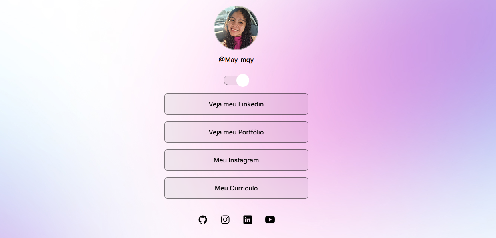

# Projeto DevLinks

Ensino exclusivo e gratuito, promovito pela Rockeseat para ensino de tecnologias Web. 

  

## 🛠 Tecnologias
  Esse projeto foi desenvolvido usando as seguintes tecnologias:

- HTML e CSS
- JavaScript
- Git e Github
- Figma
